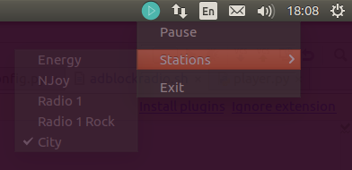

# AdBlockRadio - Internet radio player that blocks advertisements

The player is currently using metadata tags, containing song title, to detect advertisement blocks.

## Requirements:

* Python 3.4 or newer 
* GStreamer 1.X
* Python bindings for GStreamer
* PyQt4
* python appdirs package
* python-daemon package (only needed, if you want the player to run as console daemon)

## How to install:

1. Install GStreamer (for streaming audio):

        sudo apt-get install gstreamer1.0
        sudo apt-get install gstreamer1.0-plugins-base
        sudo apt-get install gstreamer1.0-plugins-good

2. Install PyQT4 (for system tray icon):

        sudo apt-get install python3-pyqt4

3. Install appdirs

        pip install appdirs

   or

        sudo apt-get install python3-pip
        /usr/bin/python3 -m pip install appdirs

4. Install python-daemon (for daemonizing player):

        pip install python-daemon

   or

        sudo apt-get install python3-pip
        /usr/bin/python3 -m pip install python-daemon

5. Download project:

        cd ~/
        git clone https://github.com/quasoft/adblockradio.git
        cd adblockradio

6. Edit list of radio stations in config.py

7. Start player in system tray:

        /usr/bin/python3 adblockradio.py

   or, to start with a specific radio station:

        /usr/bin/python3 adblockradio.py --station http://mp3channels.webradio.antenne.de/chillout

   *You can add more radio stations to config.py file*

8. Start player as daemon:

        ./adblockradio.sh start http://mp3channels.webradio.antenne.de/chillout

   To stop daemon:

        ./adblockradio.sh stop

## Credits

* System tray icons by https://www.iconfinder.com/ChihabJr
